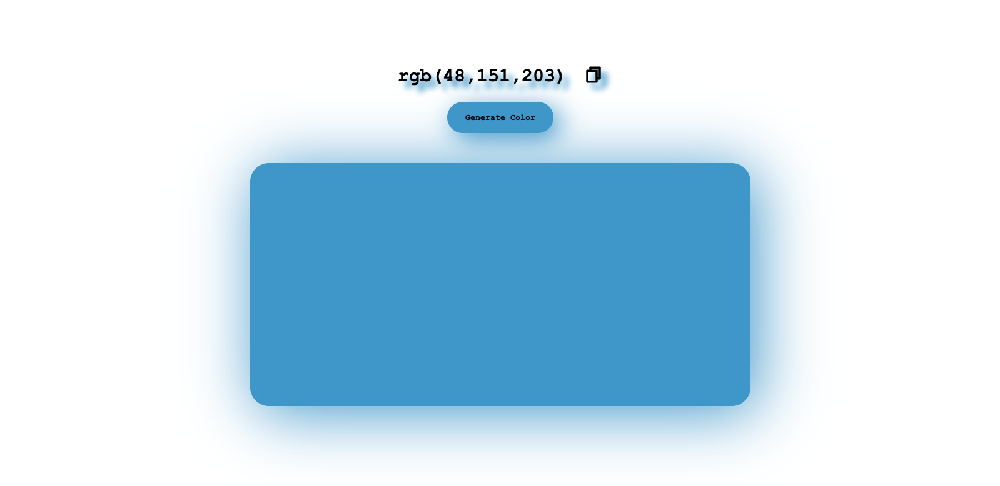

# 🎨 Random Color Generator
Try it now! 
Live Link : https://color-picker-d4od.onrender.com
---
A simple, interactive web project that generates a random RGB color with the click of a button. It provides a live preview and an easy "copy to clipboard" feature.

## 📸 Preview

## 📖 About

This is a clean, lightweight, and fun front-end project built with vanilla HTML, CSS, and JavaScript. The main goal is to generate a random RGB color, display it to the user, and update the page's elements to match.

The project dynamically changes the color of a preview box, the main button, and even applies matching `box-shadow` and `text-shadow` effects for a modern look.

## ✨ Features

- **Random Color Generation:** Get a new unique `rgb(r, g, b)` value with every click.
- **Live Preview:** See the generated color instantly applied to the page.
- **Copy to Clipboard:** Easily copy the RGB value to your clipboard by clicking the copy icon that appears next to the text.
- **Dynamic Styling:** The UI (button, shadows) changes to match the new color.
- **User Feedback:** The copy icon briefly changes to a "check" mark to confirm the color has been copied.

## 💻 Tech Stack

- **HTML5**
- **CSS3** (for styling and shadows)
- **JavaScript (ES6+)** (for DOM manipulation and color logic)
- **RemixIcon** (for the copy/check icons)
